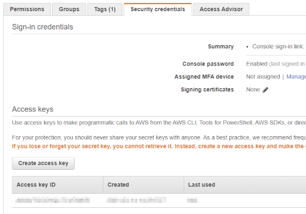

# Welcome to AWS Code Commit
You can use the AWS Management Console and upload, add, or edit a file to a repository directly from the AWS CodeCommit console. This is a quick way to make a change. However, if you want to work with multiple files, files across branches, and so on, consider setting up your local computer to work with repositories. In this demo, we will learn how to setup AWS Code Commit using SSH and IAM roles.

## Set Up SSH Connections to AWS CodeCommit Repositories

_**Note:** This is for Linux/Mac/Windows users._

_**Note to Windows users:** The default location for git ssh keys/configuration is ```%HOMEDRIVE%%HOMEPATH%\.ssh```. The commands below should be run from a git-bash 
window from that location. If you location is different, then ensure you open your git-bash session from within the correct directory._

### 1.  Create IAM Users/Groups
    It is better to have a seperate group such as `Developers` and add your users to that group.

    Add Group Permission - Managed Policy - `AWSCodeCommitFullAccess` to the group you just created.

    Add any users to that group that need access to the policy `AWSCodeCommitFullAccess`.

### 2. Create SSH Keys
    ```sh
    # Create the `.ssh` directory in your home directory if it isn't there already
    # mkdir -p $HOME/.ssh
    cd $HOME/.ssh
    ssh-keygen
    # [here just create the name codecommit_rsa and leave all fields blank *just click enter*]
    cat codecommit_rsa.pub  
    ```
### 3. Associate Your Public Key with Your IAM User

    Now we need to enter our `codecommit_rsa.pub` into AWS IAM. 
     
    Click the 'Create access key' button, paste the key contents, then click 'Upload SSH public key'.

    Now, copy the SSH key ID to your clipboard.This is the Access key ID. For example `APKAEIBAERJR2EXAMPLE`




### 4. Add AWS CodeCommit to Your SSH Configuration
    ```sh
    cd $HOME/.ssh
    touch config
    chmod 600 config
    cat > $HOME/.ssh/config << "EOF"
    Host git-codecommit.*.amazonaws.com
      User YOUR_SSH_KEY_ID_FROM_IAM
      IdentityFile ~/.ssh/codecommit_rsa
    EOF
    ```

### 5. Test your SSH configuration:
    ```sh
    ssh git-codecommit.us-east-1.amazonaws.com
    ```

You should see a response similar to the following:
> You have successfully authenticated over SSH. You can use Git to interact with AWS CodeCommit. Interactive shells are not supported.Connection to git-codecommit.us-east-1.amazonaws.com closed by remote host.